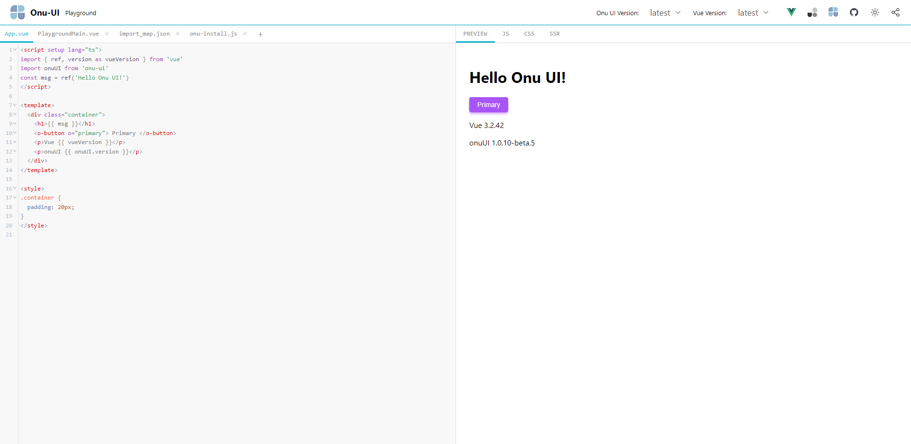

# Onu UI playground

## 🎉supports

- vue3
- options and setup api
- typescript
- auto import onu ui

> ‼️ onu-ui version support >= 1.0.8

## 💥 relate project

- 🥝 [vue3](https://staging-cn.vuejs.org/)
- 🥑 [unocss](https://github.com/unocss/unocss)
- 🌸 [onu-ui](https://onu.zyob.top/)

## 🙇‍ thanks

- [@vue/repl](https://github.com/vuejs/repl)
- [vue-use](https://github.com/vueuse/vueuse)
- [element-plus-playground](https://github.com/element-plus/element-plus-playground)
